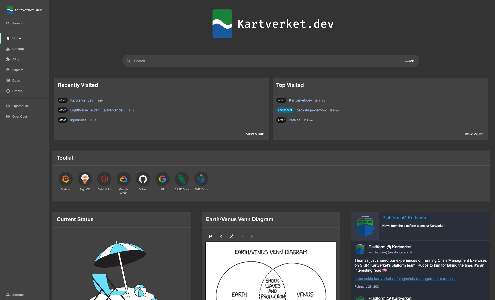

# [Kartverket.dev](https://kartverket.dev)

Kartverket.dev is Kartverket's developer portal. It is built using
[Backstage](https://backstage.io/), and helps Kartverket's internal developers
discover and use Kartverket's APIs and services.

## Contributing

Want to contribute to the developer portal? Head over to
[CONTRIBUTING.md](./CONTRIBUTING.md) to get started.
