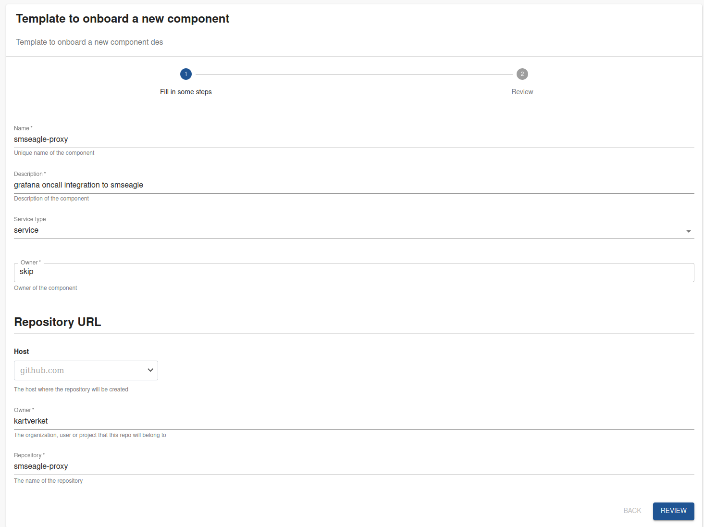
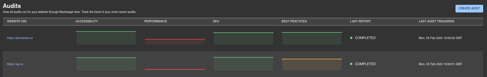
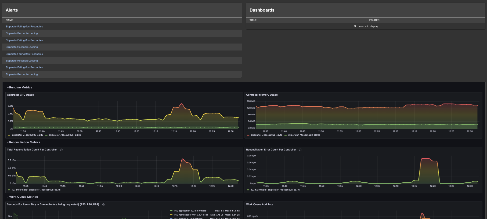
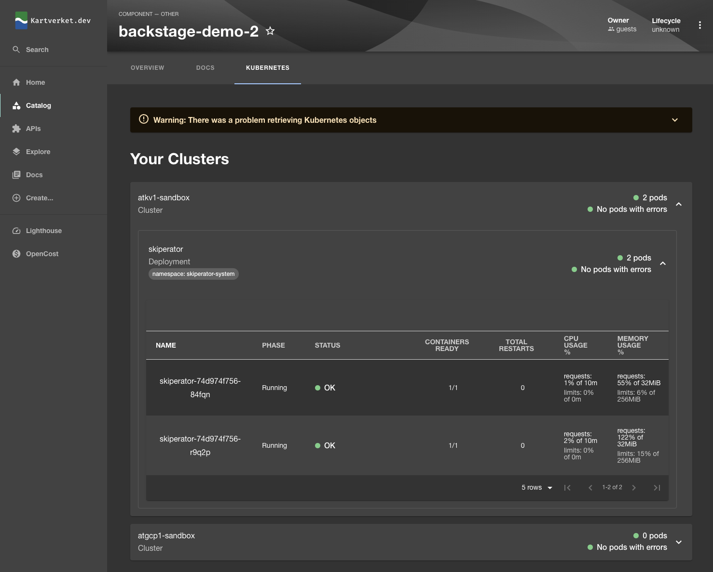

## Onboarding
In order to use the developer portal the first step to adding your service is to add it to the [catalog](/catalog). The catalog is a list of all the services that exist in Kartverket. 

Since the developer portal is based on Backstage we have configured it to scan all repositories belonging to the Kartverket organization for backstage configuration files.
You can read more about such files [here](https://backstage.io/docs/features/software-catalog/descriptor-format#kind-component).

To make it easier for you to add your service to the catalog we have created a [template](/create/templates/default/catalog-onboarding). 
This template will create a basic backstage configuration for you, and create a pull request in your repository.

After merging the pull request your service will be added to the catalog within 30 minutes.



## Customizing components

Once your component is added to the catalog, you may want to add optional features to the detail view of the component. Currently we support the following features:

- [Onboarding](#onboarding)
- [Customizing components](#customizing-components)
  - [Lighthouse Insights](#lighthouse-insights)
  - [Grafana alerts and dashboards](#grafana-alerts-and-dashboards)
  - [Kubernetes](#kubernetes)

### Lighthouse Insights


Your application can opt in to being scanned by Lighthouse, an open-source,
automated tool for improving the quality of web pages. Lighthouse has audits
for performance, accessibility, progressive web apps, SEO, and more.

Add the following annotation to your component:

```
apiVersion: backstage.io/v1alpha1
kind: Component
metadata:
  # ...
  annotations:
    lighthouse.com/website-url: # A single website url e.g. https://backstage.io/
```

This will enable scanning of the website periodically. It should show up in the
lighthouse module withing 24 hours.



### Grafana alerts and dashboards



A component will often have Grafana monitoring and dashboards, and you can
reference these in your detail view. 

```
apiVersion: backstage.io/v1alpha1
kind: Component
metadata:
  # ...
  annotations:
    grafana/alert-label-selector: # An alert selector, for example source=skiperator
    grafana/dashboard-selector: title @> 'skiperator' # A dashboard selector
    grafana/overview-dashboard: # A dashboard URL, for example: 'https://monitoring.kartverket.cloud/d/b48615bc-3801-4d0b-be37-858483dfb3d3/skiperator?orgId=1&kiosk'
```

For details on how to write a dashboard selector see [this page](https://github.com/backstage/community-plugins/blob/main/workspaces/grafana/plugins/grafana/docs/dashboards-on-component-page.md).

### Kubernetes



If your application is running on Kubernetes, you can add a label selector to
your component to make the component show data from Kubernetes. Today this will
show the number of pods and their status on the cluster, along with some metrics
like CPU and memory usage.

Adding this will enable us to add more features in the future that show data of
your app on Kubernetes, for example showing exposed endpoints on your Skiperator
Application manifest.

```
apiVersion: backstage.io/v1alpha1
kind: Component
metadata:
  # ...
  annotations:
    backstage.io/kubernetes-label-selector: # A label selector, for example app=skiperator
```
