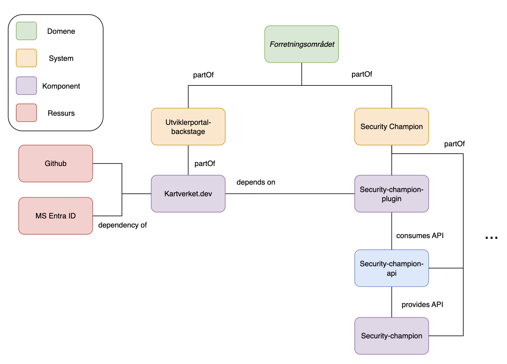

# Felles begreper for Backstage
For at vi skal bygge en tydelig arkitekturoversikt i Backstage for Kartverket, er det viktig at vi bruke de samme begrepene konsekvent. Dette gjør det enklere for alle å finne og forstå systemene våre. Her finner du definisjonene vi skal bruke på tvers av team. Når du legger inn dokumentasjon, sjekk at du følger disse.

## Entiteter

### Domain
Et domene representerer et overordnet forretningsområde eller produktområde. Det brukes for å gruppere systemer som hører naturlig sammen basert på funksjon, eierskap eller forretningsverdi.

**Eksempler**

- Betaling
- Kundeoppfølging
- Analyse
- Eiendomsdata

### Subdomain
Et Subdomain er en eller flere underinndelinger av et domain, brukt for å strukturere store områder i mer håndterbare deler. Subdomener grupperer systemer som løser relaterte oppgaver eller representerer en tydelig forretningskapabilitet.

**Eksempler**

- Domain: Kunde

    - Subdomain: Kundeoppfølging

    - Subdomain: Autentisering

- Domain: Eiendomsdata

    - Subdomain: Datadeling

    - Subdomain: Rapportering

### System
Et system er en samling av komponenter som sammen løser et tydelig formål innenfor et domene. Systemet kan bestå av flere komponenter som samarbeider for å levere en funksjonalitet.

**Eksempler**

- Systemet “Kundeportal” består av webapp, backend-API og databehandlingsjobb.
- Systemet “Rapporteringsmotor” består av flere komponenter for datahåndtering og visualisering.

### Component
En komponent er en selvstendig del av et system — en tjeneste, et bibliotek eller en applikasjon. Den har vanligvis sitt eget repository (med mindre det er et monorepo) og kan kjøres, bygges og rulles ut separat.

**Eksempler**

- frontend-app (React)
- customer-service-api (Spring Boot backend)

**Typer**:

- website, library, service, ops, documentation

### API
Et API beskriver et grensesnitt som en komponent tilbyr eller bruker.
APIer gjør det synlig hvordan systemer og komponenter kommuniserer. 

**Eksempler**

- `customer-service-api` tilbyr et REST API for kundeinformasjon
- `frontend-app` bruker APIet `customer-service-api`

**Typer**:

- openapi, asyncapi, graphql, wsdl, eller en egendefinert type.

**Merk**:
Eksterne API-er (for eksempel Altinn, FREG) skal ikke registreres som API under komponenten, men som en Resource med typen external-api. Dette gjør det mulig å modellere avhengigheter mellom interne komponenter og eksterne tjenester. Se Resource-seksjonen for detaljer.

### Resource
En Resource er en ekstern eller delt ressurs som et system eller en komponent er avhengig av, men som ikke nødvendigvis eies av samme team. Dette kan være enten tekniske infrastrukturkomponenter eller eksterne integrasjoner.

**Eksempler**

- Teknisk ressurs: internt driftede ressurser (databaser, køer, lagring, cluster)
- Ekstern integrasjon: tredjeparts- eller myndighetstjenester (Altinn, Digdir, Facebook API, BankID)

### Andre
**Grupper** og **brukere** blir hentet fra Kartverkets Entra ID. Grupper blir bare hentet hvis hvis de har prefikset *AAD - TF - TEAM*

## Hvor skal entitetene defineres i Kartverket?

### Domener/subdomener
I et felles repo som sentraliserer entitetsdefinisjoner som skal brukes på tvers av organisasjonen.
### Systemer
Systemer defineres hovedsakelig i et felles sentralisert repo, men vi ønsker ikke å sette føringer på teamenets evne til å definere systemer i egne repoer hvis det er nyttig.
### Ressurser
En kombinasjon av sentralisering og egne definisjoner. Definisjonen av plattform-ressurser vil leve i et sentralisert repo og teamene kan selv legge til ressurser de bruker i egne repoer eller direkte inn på et eget område i det sentraliserte repoet. 
### Komponenter og APIer
Teamene eier definisjonen og har ansvar for å plassere dem i et repo de eier.

## Modelleringseksempler

### Eksempel 1: Security Champion og Utviklerportalen
Dette eksempelet er inspirert av Utviklerportalen, Kartverket.dev. Utviklerportalen er definert som et system som består av Kartverket.dev som her er modellert som en component. Kartverket.dev integrerer med de eksterne ressursene: GitHub, for data, og Microsoft Entra ID, for autentisering og henting av brukere og grupper. 

Security champion er et system som Kartverket.dev avhenger av. Security champion består av en backend-component som tilbyr et API som konsumeres av en frontend backstage-plugin.

